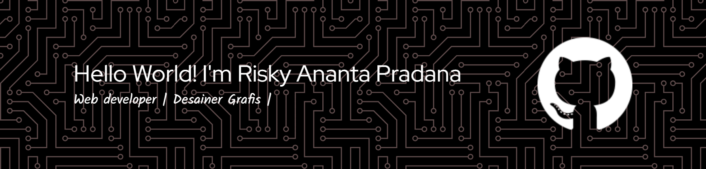

## Hello World! I'm Risky Ananta Pradana👋

<!--
**riskyananta29/riskyananta29** is a ✨ _special_ ✨ repository because its `README.md` (this file) appears on your GitHub profile.

Here are some ideas to get you started:

- 🔭 I’m currently working on ...
- 🌱 I’m currently learning ...
- 👯 I’m looking to collaborate on ...
- 🤔 I’m looking for help with ...
- 💬 Ask me about ...
- 📫 How to reach me: ...
- 😄 Pronouns: ...
- ⚡ Fun fact: ...
--> 
🧑‍🎓**I’m Studying to become a programmer ...**

Hello👋, I’m a Computer Science student at the State Islamic University of North Sumatra, currently pursuing my dream of becoming a great programmer. With the prayers and support of my friends, I aim to stay passionate and keep growing in the challenging world of IT.

